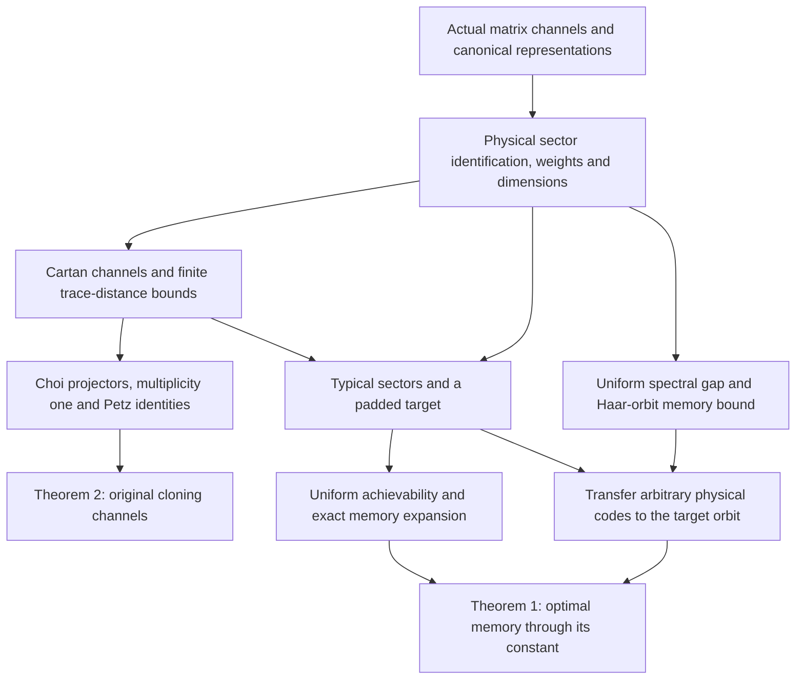

# Current proof structure

This map follows the formal proof of [[Article|Article Theorems 1 and 2]].
The source labels `thm:qmdl` and `thm:main` identify the targets. The arrows
show mathematical dependencies, grouping many Lean modules into each stage;
they are not a literal graph of every import. See [[formalization|Formalization and reproduction]] for
reproduction and review status. The [Lean explorer](proof-explorer.md) complements
this route with searchable compiled statements, direct dependencies, reverse
references and module imports.
The [[correspondence|Paper ↔ Lean correspondence]] locates the manuscript
statements, their proof guides, and the exact declarations used along this route.

## The dependency map

Click a stage to read its explanation. The theorem nodes open their checked
Lean statements in the explorer.

The compression argument uses the constructed Cartan channels and their
proved error bounds. Identifying those channels with the original Choi and
Petz formulas establishes the advertised cloning endpoint; it is not an
extra hypothesis required from a reader of the compression theorem.

## 1. Build the representations and their dimensions

The formalization starts with finite complex matrices and actual CPTP
channels. Canonical irreducible representations are constructed inside
tensor products of exterior powers. The physical tensor power decomposes
into actual irreducible sectors, and highest-weight classification identifies
those sectors with the canonical models.

Ordered Lie words give highest-weight and weight-support facts. The actual
representation's Casimir equation, permutation symmetry and highest line
lead to its character identity. Extracting finite polynomial coefficients
then gives the dimension formula; the GT counting formula and Weyl product
are proved and connected to this same representation.

Read [[concepts/schur-weyl-duality|Physical sector decomposition]], [[concepts/weyl-dimension-formula|Weyl dimension formula]] and
[[results/lemmas/weyl-dimension-asymptotic|Dimension asymptotics]]. The key source files are
[CanonicalCharacterIdentity.lean](https://github.com/JWang226/Quantum-Minimum-Description-Length/blob/main/lean/FreeEntropy/CanonicalCharacterIdentity.lean),
[WeylDimensionExtraction.lean](https://github.com/JWang226/Quantum-Minimum-Description-Length/blob/main/lean/FreeEntropy/WeylDimensionExtraction.lean)
and [CanonicalDimension.lean](https://github.com/JWang226/Quantum-Minimum-Description-Length/blob/main/lean/FreeEntropy/CanonicalDimension.lean).

## 2. Prove the finite cloning bound directly in trace distance

For supported partitions $\mu,\nu$ with dominant integral difference,
write $D=\|\nu-\mu\|_1$ and let $b_\mu$ be the minimum supported adjacent-row
gap. The goal is the two-sided error estimate $C_{d,x}D/(b_\mu+1)$.
The signed auxiliary construction handles negative entries of the difference
by determinant shifts; its scalar factors cancel from the channels.

The quantitative argument combines weight multiplicity bounds, shallow exact
multiplicities, a highest-weight slice and a Casimir gap within each relevant
total-weight sector, derived from the complete tensor decomposition. Traced projector deficits are averaged using a
uniform mean-depth bound. Dimension and normalization losses are controlled
before taking the final trace norm. This avoids the older route through an
$n$-dependent fidelity truncation followed by a square-root conversion.

Read [[results/cloning-fidelity|Cloning accuracy]], [[results/lemmas/perturbation-lemma|Highest-weight projector deficit]],
[[results/lemmas/tail-mass|Uniform mean depth]], [[results/lemmas/probability-ratio|Eigenvalue ratio]] and
[[results/lemmas/dimension-ratio|Dimension ratio]]. Representative source files are
[SignedAuxiliaryModel.lean](https://github.com/JWang226/Quantum-Minimum-Description-Length/blob/main/lean/FreeEntropy/SignedAuxiliaryModel.lean),
[CanonicalCloningBounds.lean](https://github.com/JWang226/Quantum-Minimum-Description-Length/blob/main/lean/FreeEntropy/CanonicalCloningBounds.lean)
and [Theorem2Canonical.lean](https://github.com/JWang226/Quantum-Minimum-Description-Length/blob/main/lean/FreeEntropy/Theorem2Canonical.lean).

## 3. Recover the manuscript's channel definitions

The finite estimate is first proved for constructed Cartan channels.
Tensor–Hom adjunction proves the needed multiplicity-one statement in the
Choi carrier. The forward projector's rank, highest vector and cyclic range
are constructed, and the reverse projector is identified with the dual
component. The transpose and partial-trace conventions are checked explicitly.
The reverse map is also shown to equal the literal Petz recovery expression.

This closes the route to the source's actual channel formulas; projectors,
multiplicity one and recovery identities are not assumed at the final endpoint.

| Description | Main source | Endpoint or role |
| --- | --- | --- |
| Cartan channels | [Theorem2Canonical.lean](https://github.com/JWang226/Quantum-Minimum-Description-Length/blob/main/lean/FreeEntropy/Theorem2Canonical.lean) | `theorem2_cloning_accuracy` |
| Original Choi-projector contractions | [Theorem2Choi.lean](https://github.com/JWang226/Quantum-Minimum-Description-Length/blob/main/lean/FreeEntropy/Theorem2Choi.lean) | `theorem2_cloning_accuracy_choi` |
| Literal reverse Petz map | [Theorem2Petz.lean](https://github.com/JWang226/Quantum-Minimum-Description-Length/blob/main/lean/FreeEntropy/Theorem2Petz.lean) | `theorem2_cloning_accuracy_petz` |
| Equal source and target rows | [CanonicalCloningSelf.lean](https://github.com/JWang226/Quantum-Minimum-Description-Length/blob/main/lean/FreeEntropy/CanonicalCloningSelf.lean) | The Cartan channels reduce to identity channels. |

The three theorem names above belong to `FreeEntropy.ExteriorRepresentation`.
See [[results/propositions/choi-matrix-lemma|Cartan and Choi formulas]] and
[[results/propositions/reverse-cloner|Reverse cloner and Petz identity]] for their mathematical meaning.

## 4. Transfer the bound to physical tensor sources

The physical source is $(U\operatorname{diag}(x)U^\dagger)^{\otimes n}$,
not an abstract family supplied with assumed sector probabilities. Actual
sector copy counts are bounded by word-type counts, and entropy estimates
bound the atypical mass. Covariance makes the estimates uniform in $U$.

For typical rows, one padded target has dimension with the required QMDL
expansion, while $D=O(\sqrt n\log n)$ and $b_\mu=\Omega(n)$.
Forward and reverse cloning therefore have error $O(\log n/\sqrt n)$.
The total physical encoder and decoder use explicit replacement channels
on atypical sectors. The sector label is not retained as an uncharged register.

Read [[results/achievability|Achievability]], [[definitions/typical-set|Typical sectors]] and
[[results/lemmas/sanov-theorem|Physical concentration]]. The construction and estimates culminate in
[PhysicalCloningChannels.lean](https://github.com/JWang226/Quantum-Minimum-Description-Length/blob/main/lean/FreeEntropy/PhysicalCloningChannels.lean),
[PhysicalCloningAccuracy.lean](https://github.com/JWang226/Quantum-Minimum-Description-Length/blob/main/lean/FreeEntropy/PhysicalCloningAccuracy.lean)
and [PhysicalUniformError.lean](https://github.com/JWang226/Quantum-Minimum-Description-Length/blob/main/lean/FreeEntropy/PhysicalUniformError.lean).

## 5. Prove the converse for arbitrary physical codes

A cyclic weight count supplies a positive spectral-gap bound uniform along
the target sequence. Irreducibility and normalized Haar integration give the
finite orbit-memory bound

$$\dim M\ge\dim\mathcal H\left(1-\frac{\overline\delta}{\gamma}\right).$$

The already constructed comparison channels turn any physical tensor-source
code into a code for that target orbit, adding an error that tends to zero.
Applying the orbit bound and the target's exact dimension asymptotic retains
the additive constant in the limiting lower bound. The arbitrary code itself
is not assumed covariant. Vanishing worst-case error implies vanishing
Haar-average error, giving the uniform-error corollary.

The formalized final route uses the sufficient constant
$\gamma_0=(1-q)^{\binom d2+1}>0$, with $q$ defined by the fixed spectrum.
It does not require the sharper intermediate constant in the Article.

Read [[results/converse|Converse]] and [[results/propositions/orbit-sector-compression|Haar-orbit memory bound]].
The main transfer is in
[PhysicalCanonicalConverse.lean](https://github.com/JWang226/Quantum-Minimum-Description-Length/blob/main/lean/FreeEntropy/PhysicalCanonicalConverse.lean),
and the final endpoint file is
[Theorem1Complete.lean](https://github.com/JWang226/Quantum-Minimum-Description-Length/blob/main/lean/FreeEntropy/Theorem1Complete.lean).

## Scope and reading order

Start with [[intro|Introduction]], then read [[results/cloning-fidelity|Cloning accuracy]],
[[results/achievability|Achievability]] and [[results/converse|Converse]]. Return to the supporting
lemmas when you need the finite estimates. The repository's
[Lean library guide](https://github.com/JWang226/Quantum-Minimum-Description-Length/blob/main/lean/README.md)
and [machine-readable source map](https://github.com/JWang226/Quantum-Minimum-Description-Length/blob/main/metadata/natural-language-map.json)
give more detailed source references.

The final endpoints cover all positive ranks, signed dominant differences
in the stated cloning domain, equal rows, and the scalar source for Theorem 1.
Earlier conditional reduction lemmas remain useful internally; their extra
premises are discharged before reaching these endpoints. Broader channel
families, optimal prescribed-error tradeoffs, repeated positive eigenvalues,
unknown-spectrum coding and the later entropy/programming discussion are
not all certified by these results. See the relevant [[wiki-index|open-question pages]]
and [[formalization|formalization scope]].

## Relation to the current Letter

The [current Letter](https://github.com/JWang226/Quantum-Minimum-Description-Length/blob/main/letter.tex)
states the full-rank memory formula at `eq:result_qmdl` and its distinct-positive,
rank-deficient extension at `eq:rank_def_qmdl`. These follow the Article's
checked achievability and converse above. Its entropy identity compares that
memory with one half of the ambient tube-volume entropy at resolution
$n^{-1}$ and includes an explicit spectrum-independent offset. The geometric
volume derivation and the conditional large-dimension bridge do not appear
in this Lean dependency graph. See the
[companion source map](https://github.com/JWang226/Quantum-Minimum-Description-Length/blob/main/metadata/letter-source-map.json)
and [[Letter|Letter overview]] for that boundary.
